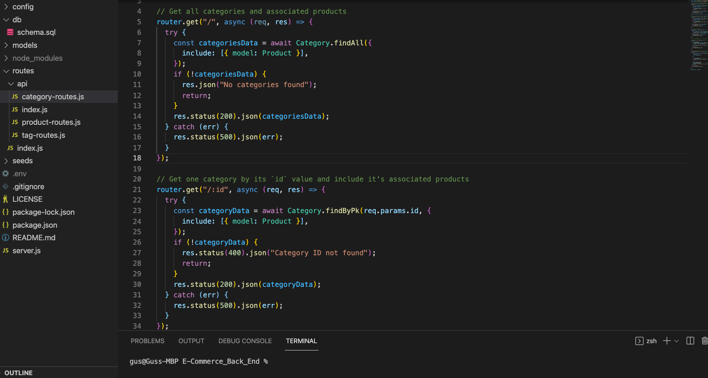
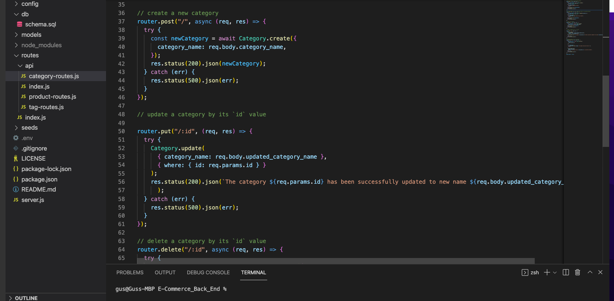
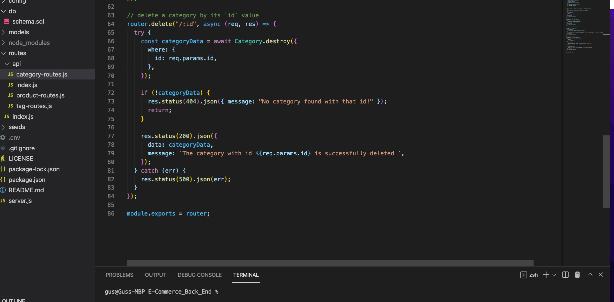

# E-Commerce_Back_End

# Description

# Table of Contents

* Installation
* Usage
* License
* Contributions
* Tests
* Questions

# Installation

*  npm i express.js mysql2 sequelize dotenv

 # Video Demo:

 * [V_Demo_1](https://watch.screencastify.com/v/A5oWD6hNDnyCJLcInxcc)
 * [V_Demo_2](https://watch.screencastify.com/v/gbjAyuSwaKVtj1hB9gwx)

 # Screen Shots:
 *    

 *    

 *    

# license

# Contributions

# Tests

 Run the test by using the fllowing command:

 # Questions

 For any questions about the repo, please contact me at: augustine2903a@gmail.com 